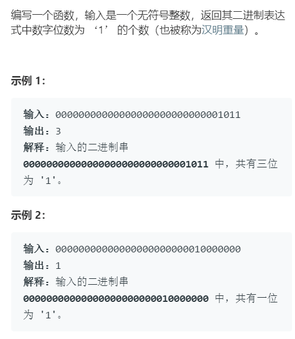

# 位运算

ascii(lower case letter) = ascii(upper case letter) + (0010 0000)2

## 趣味小技巧

1. 英文字符转换为小写
``` java
('a' | ' ') == 'a'
('A' | ' ') == 'a'
```

|ascii|二进制|
|---|---|
|ascii('A')|0100 0001|
|ascii(' ')|0010 0000|
|ascii('a')|0110 0001|

2. 英文字符转换为大写
``` java
('a' & '_') == 'A'
('A' & '_') == 'A'
```

|ascii|二进制|
|---|---|
|ascii('a')|0110 0001|
|ascii('_')|0101 1111|
|ascii('A')|0100 0001|

3. 英文字符大小写互换
``` java
('a' ^ ' ') == 'A'
('A' ^ ' ') == 'a'
```

|ascii|二进制|
|---|---|
|ascii('a')|0110 0001|
|ascii(' ')|0010 0000|
|ascii('A')|0100 0001|

4. 判断两个数是否异号

``` java
int x = -1, y = 2;
bool f = ((x ^ y) < 0); // true

int x = 3, y = 2;
bool f = ((x ^ y) < 0); // false
```

利用的是补码编码的符号位判断是否异号，用乘积或商判断两个数是否异号可能造成溢出。

5. 不用临时变量交换两个数

``` java
int a = 1, b = 2;
a ^= b;
b ^= a;
a ^= b;
// 现在 a = 2, b = 1
```

注意：在交换数组中两个数时，要判断下标 i 和 j 是否相等，如果下标相等上述操作的实际上是同一个数的内存空间，异或后该数为 0，造成与原逻辑不符。

6. 加一

``` java
int n = 1;
n = -~n;
// 现在 n = 2
```

7. 减一

``` java
int n = 2;
n = ~-n;
// 现在 n = 1
```

## n & (n-1)

利用 `n & (n-1)` 消除 n 的二进制表示中的最后一个 1。

.png)

1. 计算汉明权重（Hamming Weight）



利用 `n = n & (n-1);` 循环消除最后一个 1，直到 `n == 0`。

2. 判断一个数是不是 2 的指数

``` java
boolean isPowerOfTwo(int n) {
    if (n <= 0) return false;
    return (n & (n - 1)) == 0;
}
```

## 题目

|题目|难度||
|---|---|---|
|[136. 只出现一次的数字](https://leetcode-cn.com/problems/single-number/)|简单|√|
|[191. 位1的个数](https://leetcode-cn.com/problems/number-of-1-bits/)|简单|√|
|[231. 2 的幂](https://leetcode-cn.com/problems/power-of-two/)|简单|√|
