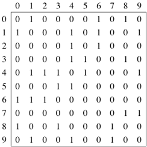
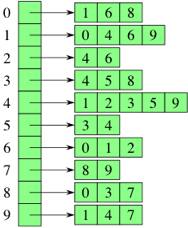
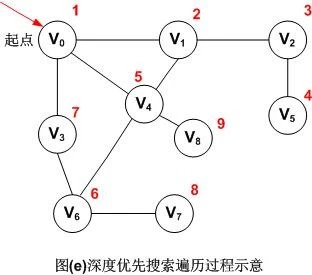
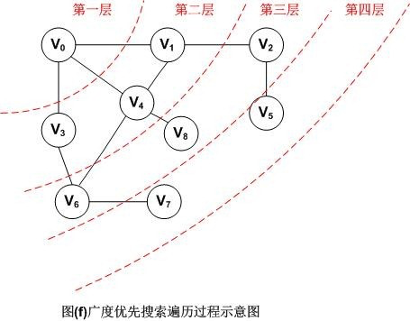
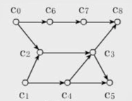
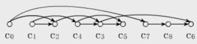

# 图

图 G 由两个集合组成：顶点 V (Vertex) 和边 E (Edge)，定义为 `G = (V, E)`。

## 题目
|题目|难度||
|---|---|---|
|[684. 冗余连接](https://leetcode-cn.com/problems/redundant-connection/)|中等
|[785. 判断二分图](https://leetcode-cn.com/problems/is-graph-bipartite/)/)|中等
|[997. 找到小镇的法官](https://leetcode-cn.com/problems/find-the-town-judge/)|简单
|[841. 钥匙和房间](https://leetcode-cn.com/problems/keys-and-rooms/)|中等
|[面试题 04.01. 节点间通路](https://leetcode-cn.com/problems/route-between-nodes-lcci/)|中等
|[1306. 跳跃游戏 III](https://leetcode-cn.com/problems/jump-game-iii/)|中等

## 1. 概念和术语

### 有向图和无向图

无向图，`(Vi, Vj)` 和 `(Vj, Vi)` 表示的是同一条边。

有向图，`<Vi, Vj>` 和 `<Vj, Vi>` 是两条不同的有向边，有向边又称为弧。

### 无向完全图和有向完全图

具有 `n * (n - 1) / 2` 条边的无向图称为无向完全图，具有 `n * (n - 1)` 条边的有向图称为有向完全图。

### 有权图和无权图

无权图，边上没有权重；有权图，边上带有权重。

### 顶点的度

- 无向图，以该顶点作为一个端点的边的数目，`Degree(Vi)`。
- 有向图，顶点的度分为入度和出度，入度表示以该顶点为终点的入边数目 `InDegree(Vi)`，出度是以该顶点为起点的出边数目 `OutDegree(Vi)`，该顶点的度等于其入度和出度之和 `Degree(Vi) = InDegree(Vi) + OutDegree(Vi)`。

边的总数 e，顶点的度 D(Vi)，有以下等式：

`e = 1/2 * (D(V1) + D(V2) + ... + D(Vn))`

### 路径

- 路径：比如在无向图 G 中，存在一个顶点序列 Vp，Vi1，Vi2，Vi3，...，Vim，Vq，使得 (Vp, Vi1)，(Vi1, Vi2)，...，(Vim, Vq) 均属于边集 E(G)，则称顶点 Vp 到 Vq 存在一条路径。
- 路径长度：是指一条路径上经过的边的数量。
- 回路：指一条路径的起点和终点为同一个顶点。

## 1. 图的表示

### 邻接矩阵

使用一个二维数组 adj[][]，如果顶点 i 和 顶点 j 之间有边，则 adj[i][j] = 1 or weight。



### 邻接表

邻接表是图的一种链式存储结构。这种存储结构类似于树的孩子链表。对于图 G 中每个顶点 Vi，把所有邻接于 Vi 的顶点 Vj 链成一个单链表，这个单链表称为顶点 Vi 的邻接表。



## 2. 图的遍历

### 深度优先搜索

深度优先搜索：从起始点开始一路向下直到最后一个顶点，然后回溯到上个顶点继续下一条路径。如此往复，直到没有路径为止。如果采用邻接矩阵存储，则时间复杂度为 O(n^2)；当采用邻接表时时间复杂度为 O(n + e)。



#### 多叉树深度优先遍历框架

``` java
void dfs(TreeNode root) {
    if (root == null) return;
    for (TreeNode child : root.children)
        dfs(child);
}
```

#### 图深度优先遍历框架

图和多叉树最大的区别是，图是可能包含环的，从图的某一个节点开始遍历，有可能走了一圈又回到这个节点。

所以，如果图包含环，遍历框架就要一个 visited 数组进行辅助：

``` java
Graph graph;
boolean[] visited;

/* 图遍历框架 */
void dfs(Graph graph, int s) {
    if (visited[s]) return;
    // 经过节点 s
    visited[s] = true;
    for (TreeNode neighbor : graph.neighbors(s))
        dfs(neighbor);
    // 离开节点 s
    visited[s] = false;   
}
```

以上框架中 `visited` 数组的操作很像回溯算法做「做选择」和「撤销选择」，区别在于位置：回溯算法的「做选择」和「撤销选择」在 for 循环里面，图遍历中对 `visited` 数组的操作在 for 循环外面。在 for 循环里面和外面唯一的区别就是对根节点的处理。回溯算法关注的不是节点，而是树枝。而对于「图」的遍历，如果把 `visited` 的操作放到 for 循环外面就会漏掉起始点的遍历。

对于有向图，含有环的时候才需要 `visited` 数组辅助；如果不含环，基本就是多叉树的遍历。

#### 题目
|题目|难度||
|---|---|---|
|[797. 所有可能的路径](https://leetcode-cn.com/problems/all-paths-from-source-to-target/)|中等|√|

### 广度优先搜索

广度优先搜索：从一个顶点开始，访问尽可能靠近它的顶点。本质上这种搜索在图上是逐层移动的，首先检查最靠近第一个顶点的层，再逐渐向下移动到离起始顶点最远的层。如果采用邻接矩阵存储，则时间复杂度为 O(n^2)；当采用邻接表时时间复杂度为 O(n + e)。



``` java
void bfs(int s) {
    boolean visited[] = new boolean[V];
    Queue<Integer> queue = new ArrayDeque<Integer>();

    // 首先访问出发点
    visited[s] = true;
    queue.add(s);

    while (!queue.isEmpty()) {
        s = queue.poll();
        doSomething(s);

        for (each node i which are adjacence of s) {
            if (!visited[i]) {
                visited[i] = true;
                queue.add(i);
            }
        }
    }
}
```

BFS 可以用于无权图中求最短路径问题，因为是逐层遍历，只要找到了节点即为最短路径。

## Dijkstra 算法

非负权图的单源最短路径问题

## Floyd 算法

## 拓扑排序

对一个有向无环图 (DAG, Directed Acyclic Graph) G 进行拓扑排序：将 G 中所有顶点排成一个线性序列，使得图中任意一对顶点 u 和 v，若边 E(G) 中有边 <u,v>，则 u 在线性序列中出现在 v 之前。通常，这样的线性序列称为满足拓扑次序 (Topological Order) 的序列，简称拓扑序列。





以上图为例，直观来看，拓扑排序就是把一幅图「拉平」，而且这个「拉平」的图里面，所有箭头方向都是一致的，如上图所有箭头都是朝右的。

### 题目
|题目|难度||
|---|---|---|
|[207. 课程表](https://leetcode-cn.com/problems/course-schedule/)|中等|√|
|[210. 课程表 II](https://leetcode-cn.com/problems/course-schedule-ii/)|中等|√|
|[310. 最小高度树](https://leetcode-cn.com/problems/minimum-height-trees/)|中等|√|
|[329. 矩阵中的最长递增路径](https://leetcode-cn.com/problems/longest-increasing-path-in-a-matrix/)|困难

## 最小生成树

### Kruskal 算法

无向带权连通图

### Prime 算法

## 并查集

## 判断无向图构成树

思路：
1. 并查集：两个节点只会互联一次，连通分量为 1。
2. （DFS BFS）连通分量为 1，边数 = 节点数 - 1
3. （DFS BFS）连通分量为 1，无环

判断连通图：
1. DFS/BFS 遍历一遍图。如果存在没有遍历到的节点，则是非连通图。
2. 并查集节点互联完后，如果有多个连通分量，则是非连通图。

判断环：
1. 数边：DFS/BFS 遍历图数边，数出的边数 < 总边数，则有环。
2. 并查集：节点间如果发生重复互联，则有环。
3. DFS/BFS 遍历图的过程中，把走过的路径断开，如果还是碰到访问过的节点，则有环。

|题目|难度||
|---|---|---|
|[261. 以图判树](https://leetcode-cn.com/problems/graph-valid-tree/)|中等|√|