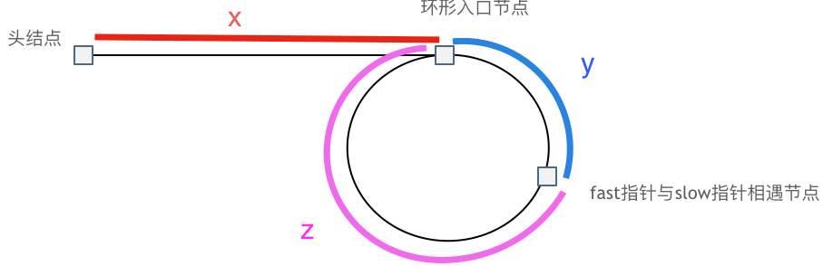

# 链表

## 1. 反转链表

- 迭代写法

``` java
public ListNode reverse(ListNode head) {
    ListNode prev = null, cur = head;
    while (cur != null) {
        ListNode temp = cur.next;
        cur.next = prev;
        prev = cur;
        cur = temp;
    }
    return prev;
}
```

- 递归写法

``` java
public ListNode reverseList(ListNode head) {
    return reverse(null, head);
}

private ListNode reverse(ListNode prev, ListNode cur) {
    if (cur == null) return prev;
    ListNode temp = cur.next;
    cur.next = prev;
    return reverse(cur, temp);
}
```

## 2. 找链表中点

- 节点数为偶数情况下，返回第一个中间结点，[1, 2, 3, 4, 5, 6] 返回 3

``` java
public ListNode mid(ListNode head) {
    ListNode slow = head, fast = head;
    while (fast.next != null && fast.next.next != null) {
        slow = slow.next;
        fast = fast.next.next;
    }
    return slow;
}
```

- 节点数为偶数情况下，返回第二个中间结点，[1, 2, 3, 4, 5, 6] 返回 4

``` java
    public ListNode middleNode(ListNode head) {
        ListNode slow = head, fast = head;
        while (fast != null && fast.next != null) {
            slow = slow.next;
            fast = fast.next.next;
        }
        return slow;
    }
```

## 3. 检测是否有环

可以使用快慢指针法，分别定义 fast 和 slow 指针，从头结点出发，fast 指针每次移动两个节点，slow 指针每次移动一个节点，如果 fast 和 slow 指针在途中相遇，说明这个链表有环。

``` java
public boolean detectCircle(ListNode head) {
    ListNode slow = head, fast = head;
    while (fast != null && fast.next != null) {
        slow = slow.next;
        fast = fast.next.next;
        if (slow == fast)
            return true;
    }
    return false;
}
```

## 4. 找环的入口



slow 指针走过的节点数为：x + y， fast 指针走过的节点数：x + y + n * (y + z)。fast 指针走过的节点数 = slow 指针走过的节点数 * 2：

(x + y) * 2 = x + y + n * (y + z)

化简可得：x = (n - 1) * (y + z) + z。则有，从头结点出发一个指针，从相遇节点也出发一个指针，这两个指针每次只走一个节点，那么当这两个指针相遇的时候就是环形入口的节点。

``` java
public ListNode findGate(ListNode head) {
    ListNode slow = head, fast = head;
    while (fast != null && fast.next != null) {
        slow = slow.next;
        fast = fast.next.next;
        if (slow == fast) {
            ListNode p1 = head, p2 = slow;
            while (p1 != p2) {
                p1 = p1.next;
                p2 = p2.next;
            }
            return p1;
        }
    }
    return null;
}
```

## 5. 两两交换链表节点

思路：cur -> node1 -> node2 -> XXX 换为 cur -> node2 -> node1 -> XXX，换完 cur 来到 node1。

``` java
public ListNode swapPairs(ListNode head) {
    ListNode dummy = new ListNode(0, head), cur = dummy;
    
    // 后面不足两个节点，则不用继续
    while (cur.next != null && cur.next.next != null) {
        ListNode node1 = cur.next;
        ListNode node2 = cur.next.next;
        node1.next = node2.next;
        node2.next = node1;
        cur.next = node2;
        cur = node1;
    }
    return dummy.next;
}
```

## 6. 合并两个升序链表

``` java
public ListNode merge(ListNode p1, ListNode p2) {
    ListNode dummy = new ListNode(0), cur = dummy;
    while (p1 != null && p2 != null) {
        if (p1.val < p2.val) {
            cur.next = p1;
            p1 = p1.next;
        } else {
            cur.next = p2;
            p2 = p2.next;
        }
        cur = cur.next;
    }
    cur.next = (p1 == null) ? p2 : p1;
    return dummy.next;
}
```

# 题目

|题目|难度||
|---|---|---|
|[2. 两数相加](https://leetcode-cn.com/problems/add-two-numbers/)|中等|√|
|[19. 删除链表的倒数第 N 个结点](https://leetcode-cn.com/problems/remove-nth-node-from-end-of-list/)|中等|√|
|[24. 两两交换链表中的节点](https://leetcode-cn.com/problems/swap-nodes-in-pairs/)|中等|√|
|[138. 复制带随机指针的链表](https://leetcode-cn.com/problems/copy-list-with-random-pointer/)|中等|√|
|[141. 环形链表](https://leetcode-cn.com/problems/linked-list-cycle/)|简单|√|
|[142. 环形链表 II](https://leetcode-cn.com/problems/linked-list-cycle-ii/)|中等|√|
|[287. 寻找重复数](https://leetcode-cn.com/problems/find-the-duplicate-number/)|中等|√|
|[160. 相交链表](https://leetcode-cn.com/problems/intersection-of-two-linked-lists/)|简单|√|
|[面试题 02.07. 链表相交](https://leetcode-cn.com/problems/intersection-of-two-linked-lists-lcci/)|简单|√|
|[203. 移除链表元素](https://leetcode-cn.com/problems/remove-linked-list-elements/)|简单|√|
|[206. 反转链表](https://leetcode-cn.com/problems/reverse-linked-list/)|简单|√|
|[92. 反转链表 II](https://leetcode-cn.com/problems/reverse-linked-list-ii/)|中等|√|
|[25. K 个一组翻转链表](https://leetcode-cn.com/problems/reverse-nodes-in-k-group/)|困难|√|
|[876. 链表的中间结点](https://leetcode-cn.com/problems/middle-of-the-linked-list/)|简单|√|
|[234. 回文链表](https://leetcode-cn.com/problems/palindrome-linked-list/)|简单|√|
|[143. 重排链表](https://leetcode-cn.com/problems/reorder-list/)|中等|√|
|[707. 设计链表](https://leetcode-cn.com/problems/design-linked-list/)|中等|√|
|[23. 合并K个升序链表](https://leetcode-cn.com/problems/merge-k-sorted-lists/)|困难|√|
