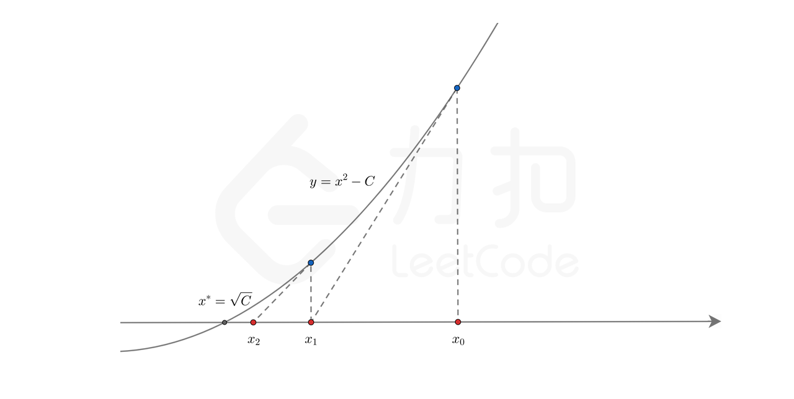
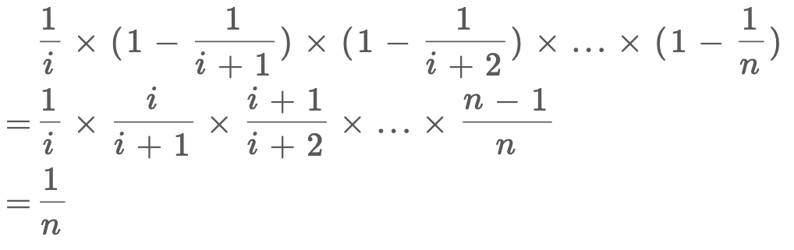
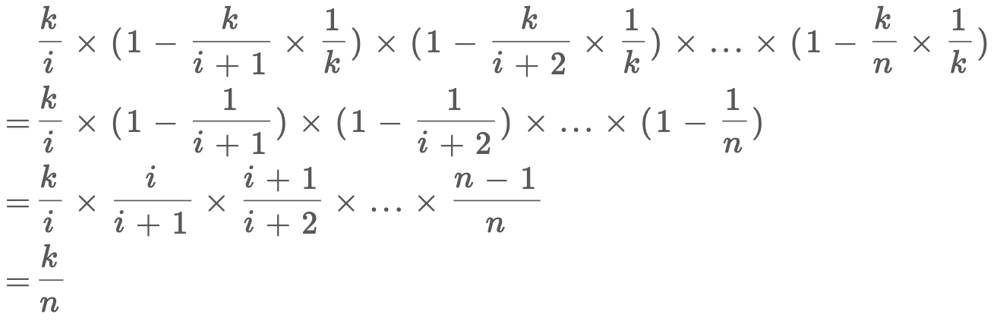

# 数学

## 1. 牛顿迭代法求平方根

设有方程 y = x^2 - C，一次导数 f'(x) = 2x，求根即为函数与 x 轴交点处 x 值。



从 x0 = C 处开始迭代，作切线，切线斜率为 2x0，切线方程为 y = 2x0(x - x0) + x0^2 - C。

令 y = 0，可求得下一迭代点 x1 = (x0 + C / x0) / 2。

则有递推公式代码：`sqrt = (sqrt + C / sqrt) / 2;`

``` java
public int sqrt(int x) {
    long sqrt = x;
    while (sqrt * sqrt > x) {
        sqrt = (sqrt + x / sqrt) >> 1;
    }
    return (int) sqrt;
}
```

## 2. 随机抽样

### 2.1 均匀随机抽样

假设集合 S 有 n 个元素，设计算法随机选 k 个数，使得每个元素被选中的概率都是 1/n。一个朴素的想法，生成 k 个不重复的 [1,n] 之间的随机数为索引，然后找到索引对应的节点。

思考：当 n 很大、或者未知、甚至是一个无限数据流时，如何高效随机抽样？

#### 蓄水池抽样算法

该算法适用于 n 很大或者未知或者无限，不能把所有 n 个元素都存放到内存的情况，只需全部遍历一次，时间复杂度为 O(n)。

1. 假设 k = 1。抽样方法：流式遍历集合，遇到第 i 个元素时，以 `1/i` 的概率选择该元素，则有 `1 - 1/i` 的概率保留原选择。 证明：该方法能保证每个元素被选到的概率为 `1/n`，对于第 i
   个元素，它被选择的概率公式如下。



代码实现：

``` java
int getRandom(Iterator itr) {
    Random r = new Random();
    int i = 0, res = 0;
    while (itr.hasNext()) {
        int val = itr.next();
        
        // 生成一个 [0, i) 之间的整数
        // 这个整数等于 0 的概率就是 1/i
        if (r.nextInt(++i) == 0) res = val;
    }
    return res;
}
```

2. 假设 k = 2。抽样方法：流式遍历集合，遇到第 i 个元素时，以 `k/i` 的概率选择该元素，则有 `1 - k/i` 的概率保留原选择。 证明：该方法能保证每个元素被选到的概率为 `k/n`，对于第 i
   个元素，它被选择的概率公式如下。



``` java
int[] getRandom(Iterator itr, int k) {
    Random r = new Random();
    int[] res = new int[k];

    // 前 k 个元素先默认选上
    for (int j = 0; j < k && itr.hasNext(); j++)
        res[j] = itr.next();

    int i = k;
    while (itr.hasNext()) {
        int val = itr.next();
        
        // 生成一个 [0, i) 之间的整数
        // 这个整数小于 k 的概率就是 k/i
        int j = r.nextInt(++i);
        if (j < k) res[j] = val;
    }
    return res;
}
```

|题目|难度||
|---|---|---|
|[382. 链表随机节点](https://leetcode-cn.com/problems/linked-list-random-node/)|中等|√|
|[398. 随机数索引](https://leetcode-cn.com/problems/random-pick-index/)|中等
|[519. 随机翻转矩阵](https://leetcode-cn.com/problems/random-flip-matrix/)|中等
|[497. 非重叠矩形中的随机点](https://leetcode-cn.com/problems/random-point-in-non-overlapping-rectangles/)|中等

### 2.2 加权随机抽样

#### A-Res

#### A-ExpJ

