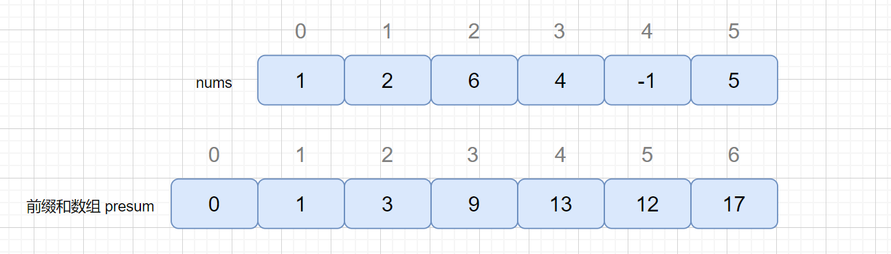
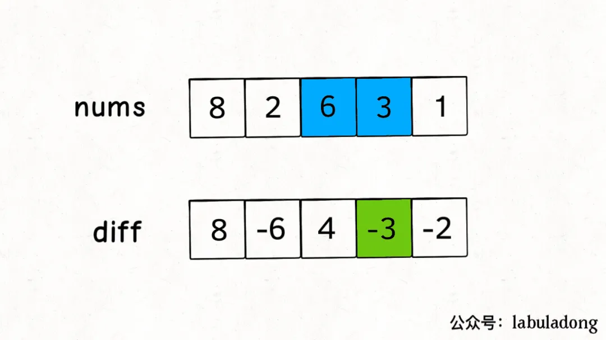

# 1. 前缀和数组

前缀和思想：预处理前缀和数组，来解决区间查询的问题，前提是运算函数必须满足结合律（比如平均数就不满足结合律）。于是区间求值的问题就变成了：

S[m..n] = S[0..n] - S[0..m-1]

其中，S[0..n] = Sn = A0 + A1 + A2 + ... + An-1;



前缀和预处理：

``` java
int[] P = new int[nums.length + 1];
for (int i = 0; i < nums.length; i++) {
      P[i + 1] = P[i] + nums[i];
 }
```

## 时间复杂度分析

- 区间查询：O(1)。
- 单点查询：O(1)。调用区间查询接口即可。
- 单点更新：O(N)。由于前缀和的计算基于递推，故被更新元素之后的所有前缀和都要更新。
- 区间更新：O(N)。调用单点更新的接口，需要 O(N^2)。如直接在前缀和数组计算，则只需 O(N)。

## 题目

|题目|难度||
|---|---|---|
|[303. 区域和检索 - 数组不可变](https://leetcode-cn.com/problems/range-sum-query-immutable/)|简单|√|
|[304. 二维区域和检索 - 矩阵不可变](https://leetcode-cn.com/problems/range-sum-query-2d-immutable/)|中等|√|
|[724. 寻找数组的中心下标](https://leetcode-cn.com/problems/find-pivot-index/)|简单|√|
|[560. 和为K的子数组](https://leetcode-cn.com/problems/subarray-sum-equals-k/)|中等|√|
|[930. 和相同的二元子数组](https://leetcode-cn.com/problems/binary-subarrays-with-sum/)|中等|√|
|[1248. 统计「优美子数组」](https://leetcode-cn.com/problems/count-number-of-nice-subarrays/)|中等|√|
|[974. 和可被 K 整除的子数组](https://leetcode-cn.com/problems/subarray-sums-divisible-by-k/)|中等|√|
|[523. 连续的子数组和](https://leetcode-cn.com/problems/continuous-subarray-sum/)|中等|√|
|[238. 除自身以外数组的乘积](https://leetcode-cn.com/problems/product-of-array-except-self/)|中等|√|

# 2. 差分数组

差分思想：主要适用场景是频繁对原始数组的某个区间的元素进行增减。



- 构造差分数组

``` java
int[] diff = new int[nums.length];
diff[0] = nums[0];
for (int i = 1; i < nums.length; i++) {
    diff[i] = nums[i] - nums[i - 1];
}
```

- 还原数组

``` java
int[] nums = new int[diff.length];
nums[0] = diff[0];
for (int i = 1; i < diff.length; i++) {
    nums[i] = nums[i - 1] + diff[i];
}
```

- 区间更新，如对区间 nums[i..j] 的元素全部加 val

``` java
diff[i] += val;
if (j + 1 < diff.length) {
    diff[j + 1] -= val;
}
```

## 前缀和、差分转换关系


## 时间复杂度分析

- 区间更新：O(1)。
- 单点更新：O(1)。调用区间更新接口即可。
- 区间查询：O(N)。对差分数组计算前缀和，同时在此过程中累计区间和。
- 单点查询：O(N)。对差分数组计算前缀和。

## 题目

|题目|难度||
|---|---|---|
|[370. 区间加法](https://leetcode-cn.com/problems/range-addition/)|中等|√|
|[1109. 航班预订统计](https://leetcode-cn.com/problems/corporate-flight-bookings/)|中等|√|
|[1094. 拼车](https://leetcode-cn.com/problems/car-pooling/)|中等|√|
|[1854. 人口最多的年份](https://leetcode-cn.com/problems/maximum-population-year/)|简单|√|
|[面试题 16.10. 生存人数](https://leetcode-cn.com/problems/living-people-lcci/)|中等|√|
|[1943. 描述绘画结果](https://leetcode-cn.com/problems/describe-the-painting/)|中等|√|
