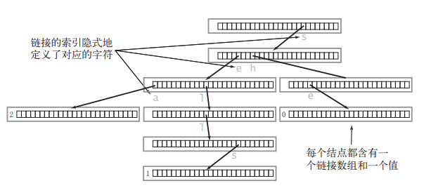
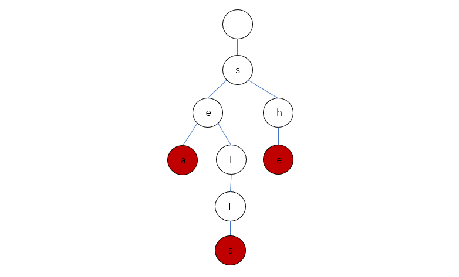

# 前缀树（字典树）

前缀树数据结构如下：

``` java
class Trie {
    boolean isEnd;    // 标识单词终点
    Trie[] next;      // 指向下一个字母
};
```

包含三个单词 "sea","sells","she" 的 Trie 结构如下：



Trie 中一般都含有大量的空链接，因此在绘制一棵单词查找树时一般会忽略空链接，简化图：



## 题目

|题目|难度||
|---|---|---|
|[208. 实现 Trie (前缀树)](https://leetcode-cn.com/problems/implement-trie-prefix-tree/)|中等|√|
|[211. 添加与搜索单词 - 数据结构设计](https://leetcode-cn.com/problems/design-add-and-search-words-data-structure/)|中等|√|
|[421. 数组中两个数的最大异或值](https://leetcode-cn.com/problems/maximum-xor-of-two-numbers-in-an-array/)|中等|√|
|[1707. 与数组中元素的最大异或值](https://leetcode-cn.com/problems/maximum-xor-with-an-element-from-array/)|困难|√|
|[440. 字典序的第K小数字](https://leetcode-cn.com/problems/k-th-smallest-in-lexicographical-order/)|困难
|[386. 字典序排数](https://leetcode-cn.com/problems/lexicographical-numbers/)|中等
|[692. 前K个高频单词](https://leetcode-cn.com/problems/top-k-frequent-words/)|中等
|[212. 单词搜索 II](https://leetcode-cn.com/problems/word-search-ii/)|困难|√|
|[1178. 猜字谜](https://leetcode-cn.com/problems/number-of-valid-words-for-each-puzzle/)|困难
